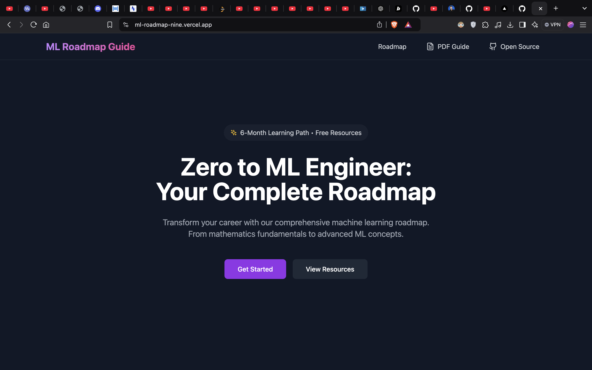

# Zero to ML Engineer: Your Complete Roadmap

## Overview

This project is a curated roadmap of free YouTube videos, organized into an 6-month bootcamp-style course for aspiring machine learning engineers. It's designed to take beginners from zero knowledge to full proficiency without the need for expensive courses or a CS degree.

## Live Demo

Experience the course roadmap: [Zero to ML Engg](https://ml-roadmap-nine.vercel.app/)

## Features

- 100% Free 6-Month Bootcamp
- Curated content from various YouTube creators.
- Structured learning path for ML enthusiats.
- Focus on practical, industry-relevant skills.
- No CS degree is required.

## Tech Stack

- Frontend: Vite, React, Typescript
- Hosting: Vercel

## Why This Course?

- Learn the basics for free before investing in expensive courses.
- Structured approach to AI and machine learning.
- Aims to help learners earn their first tech salary.
- Provides a foundation for further specialized learning.

## Contributing

We welcome contributions from everyone. Please read our [contributing guide](./CONTRIBUTING.md) to get started.

